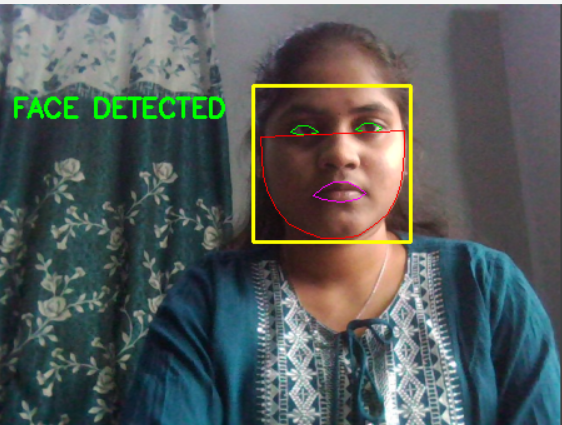
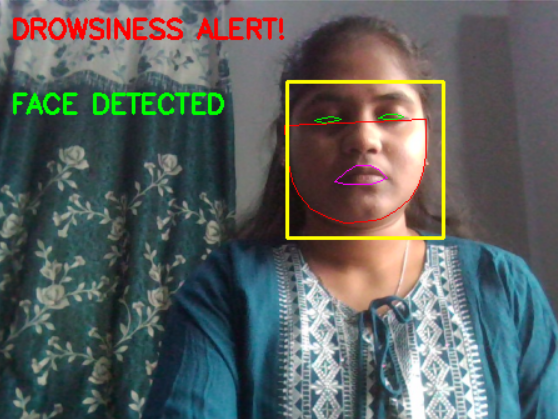
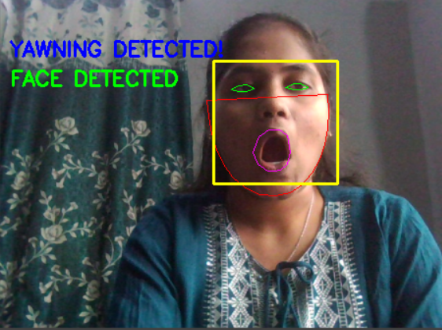
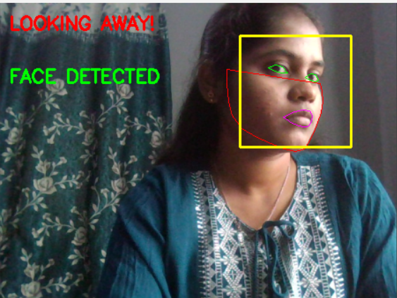
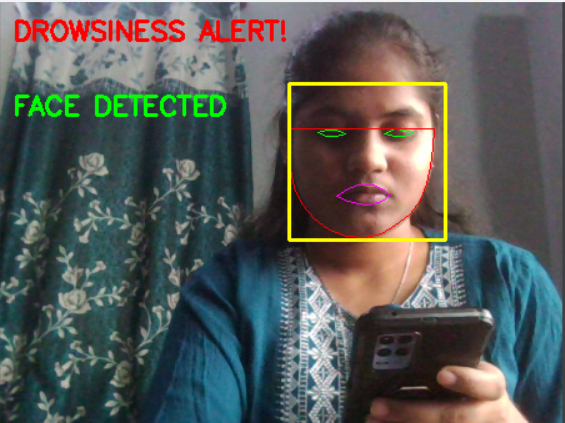

# 🚗 Distracted Driving Detection System using OpenCV

## 📌 Overview

Distracted Driving Detection System is a real-time computer vision application developed using Python, OpenCV, and dlib. The system continuously monitors the driver's facial behavior through a webcam and detects signs of distraction and fatigue that may lead to road accidents.

The project is designed to improve driver safety by identifying drowsiness, yawning, looking away from the road, and mobile phone usage. Whenever unsafe driving behavior is detected, the system generates an alert to warn the driver.

---

## 🎯 Problem Statement

Driver fatigue and distraction are among the major causes of road accidents worldwide. Traditional monitoring methods are often ineffective in detecting driver attention levels in real time.

This project aims to develop an intelligent vision-based system capable of monitoring driver behavior and providing timely alerts whenever signs of fatigue or distraction are observed.

---

## ✨ Features

### 😴 Drowsiness Detection

Monitors eye closure using facial landmarks and Eye Aspect Ratio (EAR). If the driver's eyes remain closed for a predefined duration, a drowsiness alert is generated.

### 🥱 Yawning Detection

Detects excessive mouth opening using facial landmark analysis and identifies yawning behavior.

### 👀 Looking Away Detection

Tracks face orientation and determines whether the driver is looking away from the road for an unsafe duration.

### 📱 Phone Usage Detection

Identifies mobile phone usage such as texting or calling while driving.

### 🔊 Real-Time Audio Alerts

Generates warning sounds whenever unsafe driving conditions are detected.

### 🎥 Live Video Processing

Processes webcam video feed continuously for real-time monitoring.

---

## 🛠️ Technologies Used

* Python
* OpenCV
* dlib
* NumPy
* SciPy
* imutils
* pygame
* Facial Landmark Detection
* Computer Vision

---

## 📚 Libraries Used

### OpenCV (cv2)

Used for image processing, video capture, face detection, and real-time monitoring.

### dlib

Used for facial landmark detection and extraction of facial feature points.

### SciPy

Used for calculating distances required for Eye Aspect Ratio (EAR) and Mouth Aspect Ratio (MAR).

### imutils

Provides utility functions for image resizing and facial landmark processing.

### pygame

Used for generating audio alerts during detection.

---

## ⚙️ Working Principle

1. Webcam captures live video frames.
2. OpenCV detects the driver's face.
3. dlib extracts 68 facial landmark points.
4. Eye landmarks are analyzed to calculate Eye Aspect Ratio (EAR).
5. Mouth landmarks are analyzed to detect yawning.
6. Face orientation is monitored to detect looking away behavior.
7. Phone presence near the face is used to identify phone usage.
8. Audio alerts are triggered whenever unsafe behavior is detected.

---

## 📁 Project Structure

opencv-drowsiness-fatigue-detection/

├── assets/

├── models/

├── Drowsiness_Detection.py

├── lcd.py

├── PYTHON.py

├── music.wav

├── shape_predictor_68_face_landmarks.dat

├── README.md

└── LICENSE

---

## 📸 Detection Results

### Normal Driver Detection



### Drowsiness Alert Detection



### Yawning Detection



### Looking Away Detection



### Phone Usage Detection



---

## ▶️ Installation

### Clone Repository

```bash
git clone https://github.com/swathika0401/opencv-drowsiness-fatigue-detection.git
```

### Install Required Packages

```bash
pip install opencv-python
pip install dlib
pip install scipy
pip install imutils
pip install pygame
pip install numpy
```

### Run Project

```bash
python Drowsiness_Detection.py
```

---

## 🔮 Future Enhancements

* Integration with embedded systems
* Vehicle-based deployment
* Cloud monitoring support
* Advanced deep learning-based driver monitoring
* Night-time detection optimization

---

## 🎓 Academic Use

This project was developed as an academic and learning-oriented computer vision application for understanding real-time driver monitoring systems.

---

## 👩‍💻 Author

**V M Swathika**

Electronics and Communication Engineering (ECE)

Python | OpenCV | Computer Vision | Embedded Systems

GitHub: https://github.com/swathika0401

---

## ⚠️ Notice

This project is intended for educational and research purposes only.

Unauthorized copying, redistribution, or commercial use without permission is prohibited.

